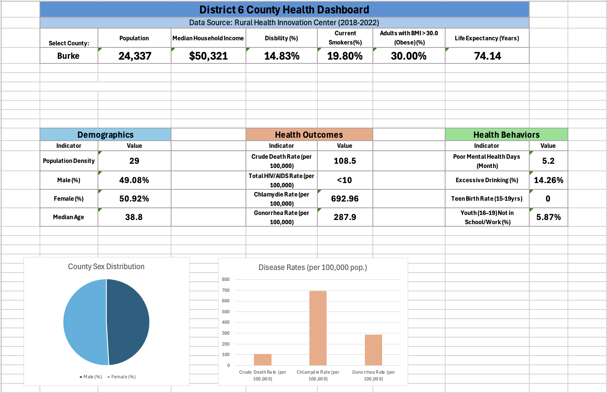

# District 6 Public Health Dashboard

An interactive Microsoft Excel dashboard developed to analyze county-level public health indicators across Georgia Department of Public Health (DPH) District 6. The dashboard enables users to select any of the 13 counties within the district and dynamically explore demographic, socioeconomic, health behavior, and health outcome indicators through automated KPIs and interactive reporting.

This project demonstrates the use of Excel as a business intelligence tool for organizing, analyzing, and presenting public health data in an accessible format for decision-makers. 

---
**Tools:** Microsoft Excel • XLOOKUP • Data Validation • Dashboard Design

---

## Dashboard Preview

---

## Features

- Interactive county selection using Data Validation drop-down lists
- Dynamic Key Performance Indicators (KPIs) updated with XLOOKUP
- County-level demographic profiles
- Health behavior indicators
- Health outcome indicators
- County comparison tables
- County snapshot reporting
- Organized data management using raw and cleaned datasets
- Professional dashboard formatting for public health reporting

---

## Skills Demonstrated

- Microsoft Excel
- Dashboard Design
- Data Cleaning and Standardization
- XLOOKUP
- Data Validation
- Data Visualization
- KPI Development
- Public Health Analytics
- Healthcare Data Analysis
- Reporting and Decision Support

---

## Workbook Contents

| Worksheet | Description |
|-----------|-------------|
| Dashboard | Interactive public health dashboard with dynamic KPIs |
| County Comparisons | County-level comparisons across key indicators |
| County Snapshots | Individual county health summaries |
| Cleaned Data | Processed dataset used to power the dashboard |
| Raw Data | Original compiled public health dataset |

---

## Data Sources

This dashboard was developed using publicly available county-level public health data, including:

- Georgia Rural Health Innovation Center (RHIC): https://www.georgiaruralhealth.org
- Georgia Department of Public Health OASIS: https://oasis.state.ga.us
- County Health Rankings & Roadmaps: https://www.countyhealthrankings.org

Indicators represent the most recent publicly available county-level estimates available from each source and may span multiple reporting years.

---

## Purpose

The goal of this project was to create an interactive dashboard capable of summarizing county-level health information to support public health planning, community health assessments, and data-driven decision making.

---
## Methodology

Publicly available county-level public health data were obtained from multiple sources, cleaned, standardized, and integrated into a single Excel workbook to support interactive reporting.

The dashboard was built using Microsoft Excel and incorporates:
- Data cleaning and standardization
- XLOOKUP functions for dynamic data retrieval
- Data Validation drop-down lists for county selection
- Interactive KPI cards
- County comparison tables
- Health indicator summaries

The dashboard updates automatically when a different county is selected, allowing users to quickly compare demographic, socioeconomic, health behavior, and health outcome indicators across Georgia DPH District 6 counties.

---
## Key Dashboard Features

- County selection updates all dashboard metrics automatically.
- Dynamic KPIs summarize key demographic, socioeconomic, and health indicators.
- County comparison tables provide additional context across District 6.
- Raw and cleaned datasets are included to demonstrate the complete data preparation workflow.

---

## Author

**Josiah Barnes**

MPH – Health Informatics  
MS – Comparative Biomedical Sciences
